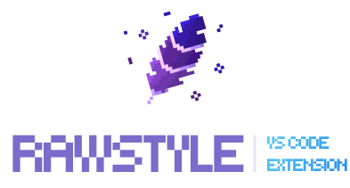
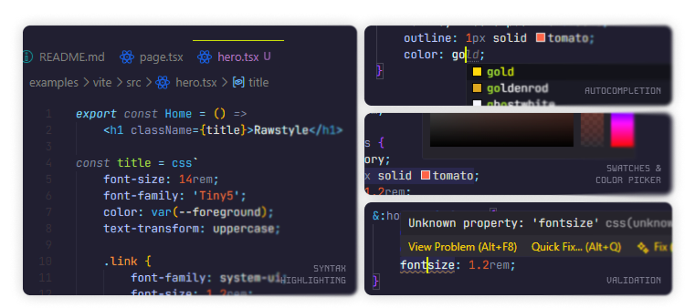

	<picture>
		<source media="(prefers-color-scheme: dark)" srcset=".github/logo-light.png">
		
	</picture>
	 
	A VS Code extension that brings <b>native CSS features to Rawstyle templates</b>
	  
	&nbsp;
	&nbsp;
	
	 
	

## 🔥 Features

- **🌈 Syntax Highlighting:** extended CSS grammar with nesting support
- **🧠 Autocomplete:** intelligent CSS property/value/snippet suggestions
- **🎨 Color Tools:** color picker, inline previews, and format conversions
- **🚨 CSS Validation:** real-time diagnostics for errors and warnings
- **💡 Hover Tooltips:** CSS property documentation on hover with MDN links
- **📦 Code Folding:** collapse CSS blocks, media queries, and nested rules
- **🎁 Enhanced `.css` Files:** improved syntax highlighting for vanilla CSS files with nesting support

## 🕹️ Usage

Once installed, the extension automatically activates when you open JS/TS(X) files. No configuration is required.

All features work seamlessly inside `css` and `gcss` template literals.

 

	<b>MIT License © 2026 <a href="https://github.com/rawstylecss">Rawstyle</a></b>

